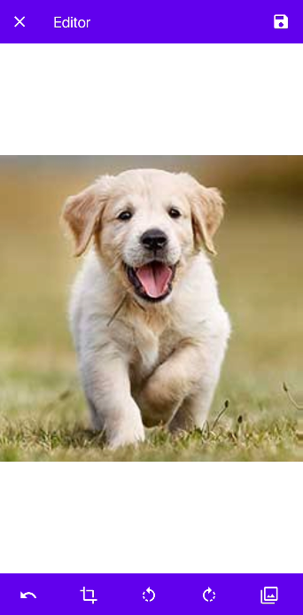
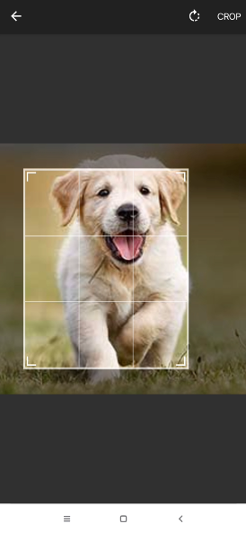
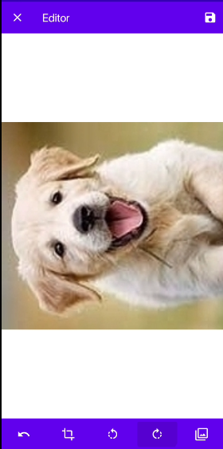
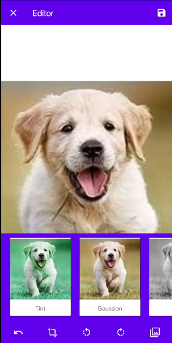

# Image Editor
A simple Image editor android app.

# Screenshots
 

# Features
- Crop image
- Roatate clockwise and anti Clock wise
- Added Filters like Tint,GrayScale,Sepia,Engrave etc
- Undo after Editing
- Saving photo after editing

# MVVM architecture
MVVM  is a Model-View-View Model architecture.It is a architecture in which we seperate Bussiness Logic from View. I tried to apply MVVM architecture but it is not perfect it have lot of mistakes

# Libraries
Some Main libraries i used for this app are

- Glide - Glide Library is used for loading images in Android's ImageView 
- Dexter - Dexter Library is used for Requesting User Permission like storage and Camera
- Canhub : Android-Image-Crop - this library is used for croping selected image
- mukeshsolanki : photofilter - this library is used for adding filters and also for roatating image

